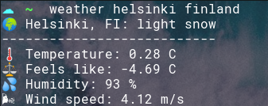
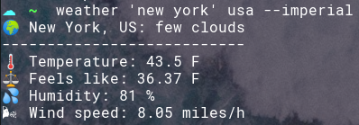

# Installation

```sh
git clone https://github.com/alkaupp/weather.git
cd weather
./install.sh
```

# Configuration

First off, you'll need to [sign-up with Open Weather Map](https://home.openweathermap.org/users/sign_up) and get an API
key. The free plan is enough to use this program.

We can use the API key in two ways. 

##### Define it as environment variable

```bash
export OPEN_WEATHER_MAP_API_KEY=my-very-own-api-key
```

Put it in your bashrc, zshrc for persistence over sessions.

##### Use flag every time you run the script

```bash
weather helsinki finland --api-key=my-own-api-key
```

# Usage

```bash
☁  ~  weather --help
usage: weather [location] [country]

Get weather for a location in a country

positional arguments:
  location           City or area
  country            Country name or country code

optional arguments:
  -h, --help         show this help message and exit
  --api-key API_KEY  API key for Open Weather Map
  --imperial
```

# Examples

```bash
weather helsinki finland
```


Use the `--imperial` flag if metric system makes no sense to you.

```bash
weather 'new york' usa --imperial
```

